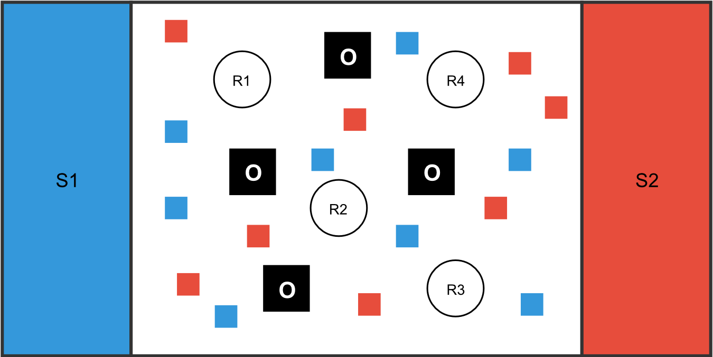
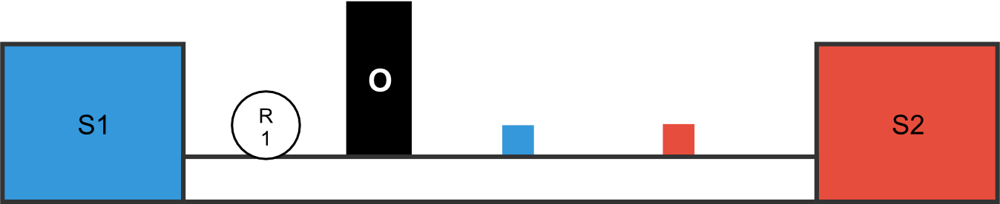

# EV3 Animal Feeder

A program for an EV3 robot to collect blocks and bring them to the correct stable to feed animals as part of a project in SPT1UE SS18 at [FH OÖ Campus Hagenberg](https://www.fh-ooe.at/en/hagenberg-campus).

## 🏁 Goals
The robot should at least have the following features
* detect obstacles and avoid them
* detect the arena boundaries and do not cross them
* drive in every direction
* find fodder (little Duplo bricks)
* lift fodder to put it onto the correct stable

## 🏟 Arena

### Topview

* S ... stable
* O ... obstacle
* R* ... robot

### Front view

## 🚧 Fixes 
### Cannot instantiate NXTColorSensor
Download the following file (https://goo.gl/HbmrX4) and replace the existing ev3classes.jar (https://goo.gl/yrVpFy).

## ⚙️ Status

## 📃 License

